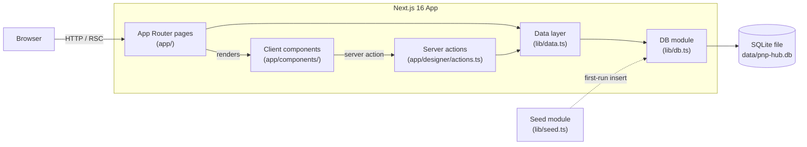

# Architecture

PnP Hub is a single Next.js application backed by a single embedded SQLite database. There are no microservices, no message queues, and no external dependencies at runtime. That's a deliberate choice: it keeps the project forkable, runnable on a laptop, and easy to reason about.

## System diagram



## Request lifecycle

A request to `/marketplace?category=Strategy&sort=rating` flows like this:

1. **Next.js routes** the request to `app/marketplace/page.tsx` (a server component).
2. The page reads `searchParams`, builds a `MarketplaceFilters` object, and calls `getMarketplaceGames(filters)` from `lib/data.ts`.
3. `lib/data.ts` constructs a parameterized SQL query (string interpolation only for whitelisted sort columns) and runs it against the database returned by `getDatabase()`.
4. `getDatabase()` lazily creates the singleton connection on first call, runs `initSchema`, and triggers seeding if the catalog version is stale.
5. Rows come back, are mapped to `GameListingView` objects (JSON columns parsed safely), and returned.
6. The server component renders `<GameCard>` for each result and streams HTML + RSC payload to the browser.

## Why SQLite?

SQLite is the right default for a project of this scope:

- **Zero ops** — no separate process, no credentials, no migrations service.
- **Fast** — `better-sqlite3` is synchronous and runs in-process; reads are ~1µs.
- **Transactional seeding** — the entire 56-game catalog seeds in a single `BEGIN/COMMIT`.
- **Easy testing** — `createDatabase(':memory:')` gives every test a clean slate.

The schema is intentionally denormalized in places (e.g., gallery and components stored as JSON columns) to keep query patterns simple. If you scale beyond a few thousand titles, swap the persistence layer in `lib/db.ts` — nothing above it depends on SQLite specifically.

## Server vs client components

The bias is **server-first**:

| Concern | Where it lives |
|---|---|
| Data fetching | Server components (default) |
| Filter forms with URL state | Server components — `searchParams` drives state |
| Print optimizer (interactive controls + `localStorage`) | Client component (`OptimizerTool`) |
| Designer uploads | Server action (`app/designer/actions.ts`) |

Only the optimizer and a few interactive widgets carry `'use client'`. Everything else is rendered on the server, which keeps the JS bundle small and the data layer testable in isolation.

## Concurrency & WAL

WAL (Write-Ahead Logging) is enabled in `lib/db.ts`:

```ts
db.pragma('journal_mode = WAL');
db.pragma('foreign_keys = ON');
```

WAL allows readers and writers to operate concurrently — important because a single dev server commonly has multiple in-flight RSC requests touching the database.

## Seed versioning

The seed module declares a `SEED_VERSION` constant. The seeder reads `catalog-version` from a metadata table and only re-runs when the constant has been bumped. Combined with the production-seed guard (`PNP_HUB_ALLOW_PRODUCTION_SEED`), this means:

- Dev: seed runs automatically when you pull a new version.
- Prod: seed never runs unless you explicitly opt in.
- Drafts: designer uploads survive seeding because the seed only touches the seeded rows.

## What's intentionally missing

- **No authentication.** The dashboard renders a single "current designer" hardcoded in `lib/seed.ts`. Add auth in your fork.
- **No real payments.** Prices are stored in cents and displayed; no Stripe integration.
- **No file storage.** "Uploaded files" are filenames in a JSON column, not actual blobs.

These are intentional scope cuts for a reference app. The data model anticipates them — see [Data Model](./data-model).
