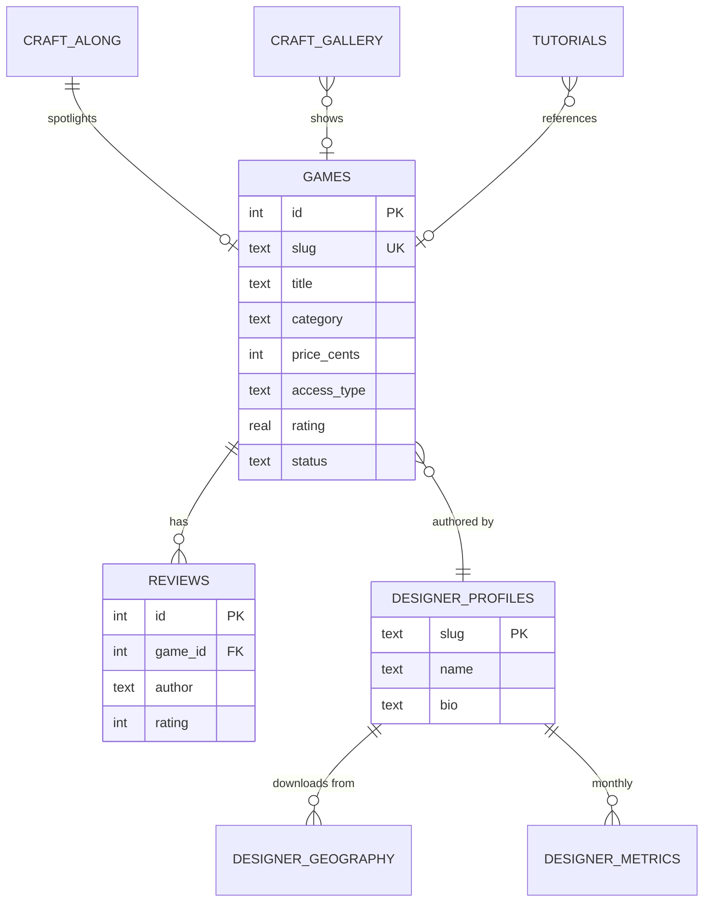

# Data Model

PnP Hub uses six core tables and a composable TypeScript type pattern that keeps each render context (card, listing, detail page) reading only the fields it actually needs.

## Entity relationships



## Tables

| Table | Purpose |
|---|---|
| `games` | The catalog. 32+ columns covering core, play info, pricing, print profile, designer info, and analytics. |
| `reviews` | Per-game reviews, verified flag, 1-5 rating. |
| `tutorials` | Step-by-step assembly tutorials, optionally linked to a game. |
| `craft_gallery` | Community-submitted photos of finished games. |
| `craft_along` | 12-month monthly spotlight schedule. |
| `designer_profiles` | Designer bios, slugs, links. |
| `designer_geography` | Country-by-country download counts (for the dashboard). |
| `designer_metrics` | Monthly download and revenue series. |
| `metadata` | Key-value store, currently used for `catalog-version`. |

Schema is defined in [`lib/db.ts`](https://github.com/TabletopFoundry/pnp-hub/blob/main/lib/db.ts) inside `initSchema()`.

## The composable type pattern

Rather than one fat `Game` type, `lib/types.ts` defines small composable groups:

```ts
export type GameCore = { id; slug; title; tagline; description; category; status };
export type GamePlayInfo = { playerMin; playerMax; playTime; complexity; ageRange };
export type GamePricing = { priceCents; accessType };
export type GamePrintProfile = { /* paper, ink, sheet count, etc. */ };
export type GameDesignerInfo = { designerName; designerSlug; revenueCents; downloadCount };
export type GameCatalogMeta = { rating; ratingCount; publishedAt; popularity; isFeatured };
export type GameDetailContent = { components: string[]; gallery: string[] };
```

These compose into render-specific views:

```ts
export type GameSummary       = GameCore & GamePlayInfo & GamePricing
                              & GamePrintProfile & GameDesignerInfo
                              & GameCatalogMeta & GameDetailContent;

export type GameListingView   = GameCore & GamePlayInfo & GamePricing
                              & GamePrintProfile & GameDesignerInfo
                              & GameCatalogMeta;  // excludes heavy JSON

export type GameCardView      = GameCore
                              & Pick<GamePlayInfo, 'playerMin' | 'playerMax' | 'playTime' | 'complexity'>
                              & GamePricing
                              & Pick<GameCatalogMeta, 'rating' | 'ratingCount'>;
```

### Why this matters

- **The card view doesn't carry kilobytes of unused JSON.** The marketplace renders 24 cards per page; `GameCardView` excludes `components_json`, `gallery_json`, and the print profile.
- **Adding a field is a one-line type change.** Add to the right group; everything that already picks it up just works.
- **Type errors point at real misuse.** If you try to render a gallery thumbnail from a `GameCardView`, the compiler stops you.

## JSON-backed columns

Two columns store JSON arrays:

| Column | Contents |
|---|---|
| `components_json` | List of physical components (e.g. `["54 cards", "1 rulebook", "4 punchout boards"]`) |
| `gallery_json` | Ordered list of image URLs for the game's media gallery |
| `uploaded_files_json` | For designer drafts — list of uploaded filenames |

All JSON columns are parsed via `safeJsonParse<T>(raw, fallback)` so a malformed value never crashes the page.

## Status & access type enums

Two enums govern catalog state:

```ts
export type GameStatus = 'published' | 'draft';
export type AccessType = 'free' | 'included' | 'purchase';
```

See [Access Types](./access-types) for the rules each value implies.
