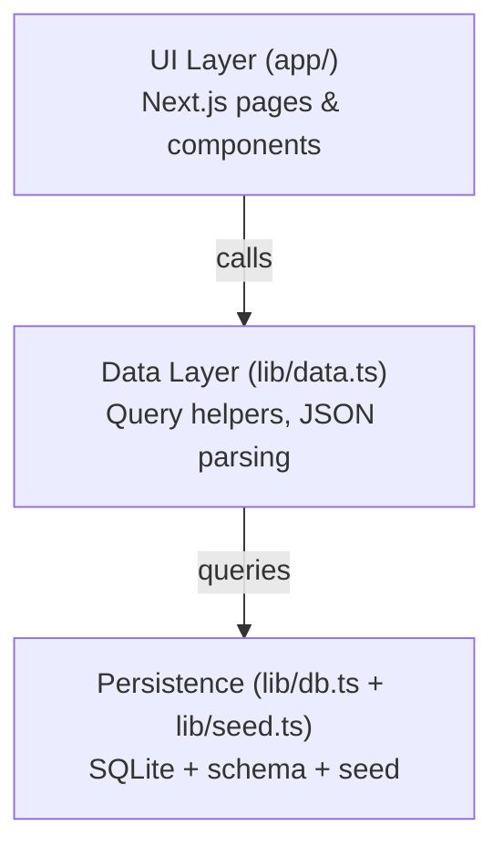

# Project Tour

A 60-second map of the codebase. Open this page in a split pane next to your editor.

```
pnp-hub/
├── app/                  # Next.js App Router pages + components
│   ├── components/       # Shared UI: GameCard, OptimizerTool, filters
│   ├── community/        # Craft gallery, tutorials, craft-along
│   ├── designer/         # Designer dashboard + server actions
│   ├── games/[slug]/     # Per-game detail page
│   ├── marketplace/      # Searchable catalog
│   ├── optimizer/        # Print optimizer tool
│   ├── layout.tsx        # Root layout (nav + footer)
│   └── page.tsx          # Landing page
├── lib/                  # Pure business logic
│   ├── constants.ts      # Revenue split, paper costs, page sizes
│   ├── data.ts           # SQL query helpers, JSON-safe parsing
│   ├── db.ts             # SQLite connection, schema, seeding
│   ├── format.ts         # Currency, percentages, dates
│   ├── seed.ts           # 56 games + 12 designers + reviews
│   └── types.ts          # All TypeScript types
├── __tests__/            # Vitest tests, mirrors lib/ and app/
├── data/                 # SQLite files (gitignored)
├── public/               # Static assets
├── website/              # This documentation site (Docusaurus)
└── docs/                 # PRD and review documents (project history)
```

## The three layers

PnP Hub is structured in three deliberate layers:



- **UI never touches SQL.** All database access goes through `lib/data.ts`.
- **`lib/` is framework-agnostic.** No `next/*` imports — pure Node + `better-sqlite3`.
- **Types flow downward.** `lib/types.ts` is consumed by both layers above.

## Key files to open first

1. **`lib/types.ts`** — composable type groups (`GameCore`, `GamePricing`, `GamePrintProfile`) assembled into views like `GameSummary`, `GameListingView`, `GameCardView`. Read this before anything else.
2. **`lib/db.ts`** — schema definitions, WAL setup, the seed guard.
3. **`lib/seed.ts`** — the 56-game catalog. Edit here to add your own titles.
4. **`lib/data.ts`** — query patterns including safe JSON parsing and filter composition.
5. **`app/marketplace/page.tsx`** — the canonical example of a server-rendered listing page.
6. **`app/optimizer/page.tsx`** + `app/components/optimizer-tool.tsx` — client-side state with `localStorage` persistence.

## Routing conventions

- All pages use the **App Router** (`app/<segment>/page.tsx`).
- Dynamic segments use brackets: `app/games/[slug]/page.tsx`.
- Loading states are co-located: `app/marketplace/loading.tsx`.
- Server actions live in `actions.ts` next to the page that uses them: `app/designer/actions.ts`.
- Pages that depend on per-request `searchParams` set `export const dynamic = 'force-dynamic'`.

## Testing layout

Tests in `__tests__/` mirror the source structure:

```
__tests__/
├── lib/
│   ├── data.test.ts
│   ├── db.test.ts
│   └── format.test.ts
└── app/
    └── components/
        └── optimizer-tool.test.tsx
```

Tests use an **in-memory SQLite** instance (`createDatabase(':memory:')`) so they never touch your dev database.
